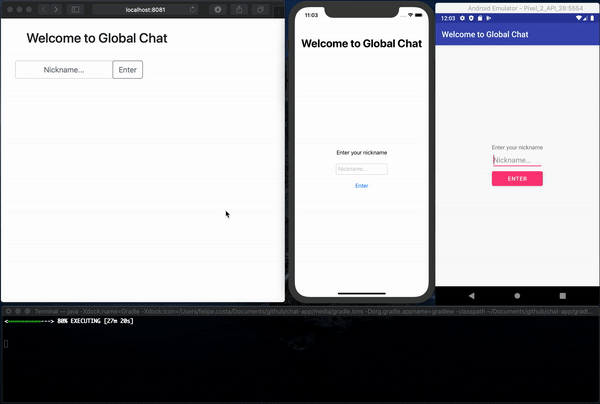

# Chat App


A chat app written in Kotlin multiplaform. This is a pet project which objective is to experiment the language in both frontend, mobile and backend. Stay tuned! :)



## Running

Explain how to run the application

### Server
Use the command below.
```
./gradlew runBackend
```

### Web client
Use the command below.
```
./gradlew runFrontend
```

### Android client
Use the command below.
```
./gradlew runAndroid -PinstallSdk 
```

#### Your own device
Use the command below.
```
./gradlew runDebug
```

### iOS
Follow steps below in order to run iOS version:

1. Install `Xcode 11.3`
2. Open `ios/ios.xcodeproj` with Xcode

License
-------

  MIT License
  
  Copyright (c) 2016 Felipe Costa
  
  Permission is hereby granted, free of charge, to any person obtaining a copy
  of this software and associated documentation files (the "Software"), to deal
  in the Software without restriction, including without limitation the rights
  to use, copy, modify, merge, publish, distribute, sublicense, and/or sell
  copies of the Software, and to permit persons to whom the Software is
  furnished to do so, subject to the following conditions:
  
  The above copyright notice and this permission notice shall be included in all
  copies or substantial portions of the Software.
  
  THE SOFTWARE IS PROVIDED "AS IS", WITHOUT WARRANTY OF ANY KIND, EXPRESS OR
  IMPLIED, INCLUDING BUT NOT LIMITED TO THE WARRANTIES OF MERCHANTABILITY,
  FITNESS FOR A PARTICULAR PURPOSE AND NONINFRINGEMENT. IN NO EVENT SHALL THE
  AUTHORS OR COPYRIGHT HOLDERS BE LIABLE FOR ANY CLAIM, DAMAGES OR OTHER
  LIABILITY, WHETHER IN AN ACTION OF CONTRACT, TORT OR OTHERWISE, ARISING FROM,
  OUT OF OR IN CONNECTION WITH THE SOFTWARE OR THE USE OR OTHER DEALINGS IN THE
  SOFTWARE.
